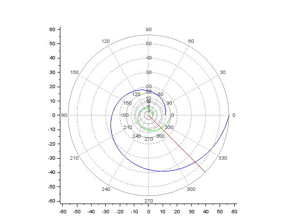

# Лабораторная работа №2
##  Доре Стевенсон Эдгар
## РУДН, 19 мая 2022 Москва, Россия

---

# Прагматика выполнения работы

---

- Изучение основ построения математических моделей на примере задачи о погоне.

- Умение строить графики траекторий движения.

---

# Цель выполнения работы

---

- Научиться cтроить математические модели для выбора правильной стратегии при решении задач поиска, рассмотрев задачу преследования браконьеров береговой охраной(задачу о погоне).

---

# Задание лабораторной работы

---

1. Записать уравнение, описывающее движение катера, с начальными условиями для двух случаев (в зависимости от расположения катера относительно лодки в начальный момент времени). 
2. Построить траекторию движения катера и лодки для двух случаев.
3. Найти точку пересечения траектории катера и лодки.

---

# Результаты выполнения лабораторной работы

---

### 1. Вывод уравнения, описывающее движение катера:

---

1. Принимаем за $t_0=0$, $x_{л0}$ - место нахождения лодки браконьеров в момент обнаружения, а за $x_{к0}=к$ - место нахождения катера береговой охраны относительно лодки браконьеров в момент обнаружения лодки.

2. Введем полярные координаты. Полюс - это точка обнаружения лодки $x_{л0} (θ=x_{л0}=0)$, а полярная ось $r$ проходит через точку нахождения катера.

   { #fig:001 width=70% }

   ---

3. Траектория катера должна быть такой, чтобы и катер, и лодка все время были на одном расстоянии от полюса $θ$, только в этом случае траектория катера пересечется с траекторией лодки.

   Поэтому катер должен двигаться некоторое время прямолинейно, пока не окажется на том же расстоянии от полюса, что и лодка. После этого катер должен двигаться вокруг полюса удаляясь от него с той же скоростью, что и лодка.

---

4. Пусть через время $t$ катер и лодка окажутся на одном расстоянии $x$ от полюса. За это время лодка пройдет $x$, а катер $k-x$ (или $k+x$ в зависимости от начального положения катера). Время, за которое они пройдут это расстояние, вычисляется как $x/v$ или $k-x/nv$ (во втором случае $k+x/nv$). Так как время одно и то же, то эти величины одинаковы. Тогда неизвестное расстояние $x$ можно найти из следующего уравнения:

   $\frac{x}{v}=\frac{k-x}{nv}$ в первом случае или

   $\frac{x}{v}=\frac{k+x}{nv}$ во втором.

   Отсюда мы найдем два значения $x_1=\frac{k}{n+1}=\frac{16.3}{5.1}$ и $x_2=\frac{k}{n-1}=\frac{16.3}{3.1}$, задачу будем решать для двух случаев.

---

5. После того, как катер окажется на том же расстоянии от полюса, что и лодка, он должен сменить траекторию и начать двигаться вокруг полюса удаляясь от него со скоростью лодки $v$.

   Для этого скорость катера раскладываем на две составляющие: $v_r$ - радиальная скорость и $v_{\tau}$ - тангенциальная скорость.

   { #fig:002 width=70% }

   $v_r=\frac{dr}{dt}$. Нам нужно, чтобы радиальная скорость была равна скорости лодки, поэтому полагаем $\frac{dr}{dt}=v$;

   Тангенциальная скорость равна произведению угловой скорости $\frac{dθ}{dt}$ на радиус $r$, $v_{\tau}=r\frac{dθ}{dt}$;

   Из рисунка видно: $v_{\tau}=\sqrt{n^2v^2-v^2}=\sqrt{15.81}v$ (учитывая, что радиальная скорость равна $v$). Тогда получаем: $r\frac{dθ}{dt}=\sqrt{15.81}v$

---

6. Решение исходной задачи сводится к решению системы из двух дифференциальных уравнений:

   $\begin{cases} \frac{dr}{dt}=v \\ r\frac{dθ}{dt}=\sqrt{15.81}v \end{cases}$ с начальными условиями $\begin{cases} θ_0=0 \\ r_0=\frac{16.3}{5.1} \end{cases}$ или $\begin{cases} θ_0=-\pi \\ r_0=\frac{16.3}{3.1} \end{cases}$

   Исключая из полученной системы производную по t, можно перейти к следующему уравнению:

   $\frac{dr}{dθ}=\frac{r}{\sqrt{15.81}}$

   Начальные условия остаются прежними. Решив это уравнение, мы получим траекторию движения катера в полярных координатах.

---

### 2. Построение траектории движения катера и лодки:

{ #fig:003 width=70% }

---

### 3. Нахождение точек пересечения траектории катера и лодки:

- Первый случай:

---

- Второй случай:

---

# Спасибо за внимание!