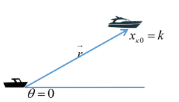
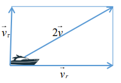
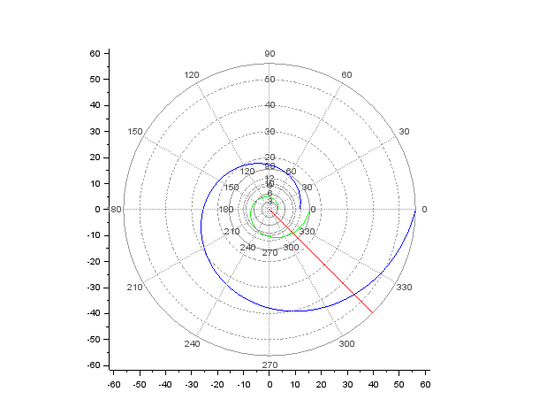
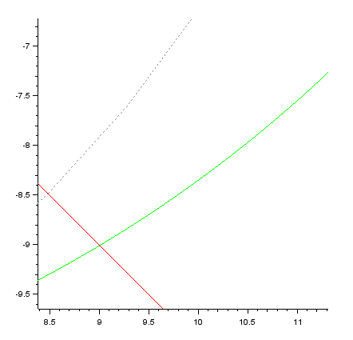
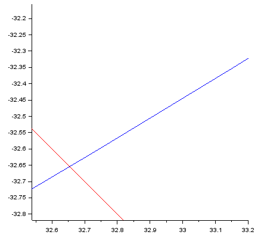

---
# Front matter
title: "Отчёт по лабораторной работе №2"
subtitle: "Вариант 44"
author: "Василий Олегович Худицкий"

# Generic otions
lang: ru-RU
toc-title: "Содержание"

# Pdf output format
toc: true # Table of contents
toc_depth: 2
lof: true # List of figures
lot: true # List of tables
fontsize: 12pt
linestretch: 1.5
papersize: a4
documentclass: scrreprt
## I18n
polyglossia-lang:
  name: russian
  options:
	- spelling=modern
	- babelshorthands=true
polyglossia-otherlangs:
  name: english
### Fonts
mainfont: PT Serif
romanfont: PT Serif
sansfont: PT Sans
monofont: PT Mono
mainfontoptions: Ligatures=TeX
romanfontoptions: Ligatures=TeX
sansfontoptions: Ligatures=TeX,Scale=MatchLowercase
monofontoptions: Scale=MatchLowercase,Scale=0.9
## Biblatex
biblatex: true
biblio-style: "gost-numeric"
biblatexoptions:
  - parentracker=true
  - backend=biber
  - hyperref=auto
  - language=auto
  - autolang=other*
  - citestyle=gost-numeric
## Misc options
indent: true
header-includes:
  - \linepenalty=10 # the penalty added to the badness of each line within a paragraph (no associated penalty node) Increasing the value makes tex try to have fewer lines in the paragraph.
  - \interlinepenalty=0 # value of the penalty (node) added after each line of a paragraph.
  - \hyphenpenalty=50 # the penalty for line breaking at an automatically inserted hyphen
  - \exhyphenpenalty=50 # the penalty for line breaking at an explicit hyphen
  - \binoppenalty=700 # the penalty for breaking a line at a binary operator
  - \relpenalty=500 # the penalty for breaking a line at a relation
  - \clubpenalty=150 # extra penalty for breaking after first line of a paragraph
  - \widowpenalty=150 # extra penalty for breaking before last line of a paragraph
  - \displaywidowpenalty=50 # extra penalty for breaking before last line before a display math
  - \brokenpenalty=100 # extra penalty for page breaking after a hyphenated line
  - \predisplaypenalty=10000 # penalty for breaking before a display
  - \postdisplaypenalty=0 # penalty for breaking after a display
  - \floatingpenalty = 20000 # penalty for splitting an insertion (can only be split footnote in standard LaTeX)
  - \raggedbottom # or \flushbottom
  - \usepackage{float} # keep figures where there are in the text
  - \floatplacement{figure}{H} # keep figures where there are in the text
---

# Цель работы

Научиться cтроить математические модели для выбора правильной стратегии при решении задач поиска, рассмотрев задачу преследования браконьеров береговой охраной(задачу о погоне).

# Задание

На море в тумане катер береговой охраны преследует лодку браконьеров. Через определенный промежуток времени туман рассеивается, и лодка обнаруживается на расстоянии 16,3 км от катера. Затем лодка снова скрывается в тумане и уходит прямолинейно в неизвестном направлении. Известно, что скорость катера в 4,1 раза больше скорости браконьерской лодки.
1. Запишите уравнение, описывающее движение катера, с начальными условиями для двух случаев (в зависимости от расположения катера относительно лодки в начальный момент времени).
2. Постройте траекторию движения катера и лодки для двух случаев.
3. Найдите точку пересечения траектории катера и лодки

# Теоретическое введение

## Полярная система координат

Полярная система координат - двумерная система координат, в которой каждая точка на плоскости определяется двумя числами - полярным углом и полярным радиусом. Полярная система координат особенно полезна в случаях, когда отношения между точками проще изобразить в виде радиусов и углов; в более распространённой декартовой, или прямоугольной, системе координат, такие отношения можно установить только путём применения тригонометрических уравнений.

Полярная система координат задаётся лучом, который называют нулевым лучом, или полярной осью. Точка, из которой выходит этот луч, называется началом координат, или полюсом. Любая точка на плоскости определяется двумя полярными координатами: радиальной и угловой. Радиальная координата соответствует расстоянию от точки до начала координат. Угловая координата также называется полярным углом или азимутом и равна углу, на который нужно повернуть против часовой стрелки полярную ось для того, чтобы попасть в эту точку.

# Выполнение лабораторной работы

## Постановка задачи. Вывод дифференциальных уравнений

По условию варианта 44:

расстояние между лодкой и катером $k=16.3$

скорость катера в $n=4.1$ раз больше скорости лодки

1. Принимаем за $t_0=0$, $x{л0}$ - место нахождения лодки браконьеров в момент обнаружения, а за $x{к0}=к$ - место нахождения катера береговой охраны относительно лодки браконьеров в момент обнаружения лодки.

2. Введем полярные координаты. Считаем, что полюс - это точка обнаружения лодки браконьеров $x_{л0} (θ=x_{л0}=0)$, а полярная ось $r$ проходит через точку нахождения катера береговой охраны. (рис. [-@fig:001])

   { #fig:001 width=70% }

3. Траектория катера должна быть такой, чтобы и катер, и лодка все время были на одном расстоянии от полюса $θ$, только в этом случае траектория катера пересечется с траекторией лодки.

   Поэтому для начала катер береговой охраны должен двигаться некоторое время прямолинейно, пока не окажется на том же расстоянии от полюса, что и лодка браконьеров. После этого катер береговой охраны должен двигаться вокруг полюса удаляясь от него с той же скоростью, что и лодка браконьеров.

4. Чтобы найти расстояние $x$ (расстояние после которого катер начнет двигаться вокруг полюса), необходимо составить простое уравнение. Пусть через время $t$ катер и лодка окажутся на одном расстоянии *x* от полюса. За это время лодка пройдет $x$, а катер $k-x$ (или $k+x$ в зависимости от начального положения катера относительно полюса). Время, за которое они пройдут это расстояние, вычисляется как $x/v$ или $k-x/nv$ (во втором случае $k+x/nv$). Так как время одно и то же, то эти величины одинаковы. Тогда неизвестное расстояние $x$ можно найти из следующего уравнения:

   $\frac{x}{v}=\frac{k-x}{nv}$ в первом случае или

   $\frac{x}{v}=\frac{k+x}{nv}$ во втором.

   Отсюда мы найдем два значения $x_1=\frac{k}{n+1}=\frac{16.3}{5.1}$ и $x_2=\frac{k}{n-1}=\frac{16.3}{3.1}$, задачу будем решать для двух случаев.

5. После того, как катер береговой охраны окажется на одном расстоянии от полюса, что и лодка, он должен сменить прямолинейную траекторию и начать двигаться вокруг полюса удаляясь от него со скоростью лодки $v$.

   Для этого скорость катера раскладываем на две составляющие: $v_r$ - радиальная скорость и $v_{\tau}$ - тангенциальная скорость. (рис. [-@fig:002])

   { #fig:002 width=70% }

   Радиальная скорость - это скорость, с которой катер удаляется от полюса, $v_r=\frac{dr}{dt}$. Нам нужно, чтобы эта скорость была равна скорости лодки, поэтому полагаем $\frac{dr}{dt}=v$;

   Тангенциальная скорость – это линейная скорость вращения катера относительно полюса. Она равна произведению угловой скорости $\frac{dθ}{dt}$ на радиус $r$, $v_{\tau}=r\frac{dθ}{dt}$;

   Из рисунка(рис. [-@fig:002]) видно: $v_{\tau}=\sqrt{n^2*v^2-v^2}=\sqrt{15.81}v$ (учитывая, что радиальная скорость равна $v$). Тогда получаем: $r\frac{dθ}{dt}=\sqrt{15.81}v$

6. Решение исходной задачи сводится к решению системы из двух дифференциальных уравнений:

   $\begin{cases} \frac{dr}{dt}=v \ r\frac{dθ}{dt}=\sqrt{15.81}v \end{cases}$ с начальными условиями $\begin{cases} θ_0=0 \ r_0=\frac{16.3}{5.1} \end{cases}$ или $\begin{cases} θ_0=-\pi \ r_0=\frac{16.3}{3.1} \end{cases}$

   Исключая из полученной системы производную по t, можно перейти к следующему уравнению:

   $\frac{dr}{dθ}=\frac{r}{\sqrt{15.81}}$

   Начальные условия остаются прежними. Решив это уравнение, мы получим траекторию движения катера в полярных координатах.

## Построение и нахождение точки пересечения траектории катера и лодки. 

*Код в Scilab*

```
s=16.3;//начальное расстояние от лодки до катера
n=4.1;//во сколько раз скорость катера больше скорости лодки
fi=3*%pi/4;
//функция, описывающая движение катера береговой охраны
function dr = f(tetha,r)
    dr=r/sqrt((n^2)-1);
endfunction;
//начальное условие в случае 1
r01=s/(n+1);
tetha01=0;
//начальное условие в случае 2
r02=s/(n-1);
tetha02=-%pi;

tetha=0:0.01:2*%pi;
//решение ДУ в случае 1
r1=ode(r01,tetha01,tetha,f);
//решение ДУ в случае 2
r2=ode(r02,tetha02,tetha,f);
//функция, описывающая движение лодки браконьеров
function xt=f2(t)
    xt=tan(fi)*t;
endfunction
t=0:1:40;
polarplot(tetha,r1,style=color('green'));//траектория движения катера в полярных координатах с начальными условиями 1
polarplot(tetha,r2,style=color('blue'));//траектория движения катера в полярных координатах с начальными условиями 2
plot2d(t,f2(t),style=color('red'));//тракетория движения лодки браконьеров
```

График траектории движения катера и лодки для двух случаев(рис. [-@fig:003]):

{ #fig:003 width=70% }

Легенда: 

*Красный* - тракетория движения лодки браконьеров

*Зеленый* - траектория движения катера в полярных координатах с начальными условиями 1

*Синий* - траектория движения катера в полярных координатах с начальными условиями 2


Точка пересечения траектории катера и лодки в случае 1 - $(9;-9)$(рис. [-@fig:004]):

{ #fig:004 width=70% }

Точка пересечения траектории катера и лодки в случае 2 - $(32.65;-32.65)$(рис. [-@fig:005]):

{ #fig:005 width=70% }

# Выводы

1. Научился cтроить математические модели для выбора правильной стратегии при решении задач поиска, рассмотрев задачу о погоне.
2. Записал уравнение, описывающее движение катера, с начальными условиями для двух случаев (в зависимости от расположения катера относительно лодки в начальный момент времени).
3. Построил траекторию движения катера и лодки для двух случаев.
4. Нашел точки пересечения траекторий катера и лодки.

# Библиография

- <code>[Кулябов Д. С. *Лабораторная работа №2*](https://esystem.rudn.ru/mod/resource/view.php?id=831032)</code>
- <code>[Кулябов Д. С. *Задание к лабораторной работе №2*](https://esystem.rudn.ru/mod/resource/view.php?id=831033)</code>